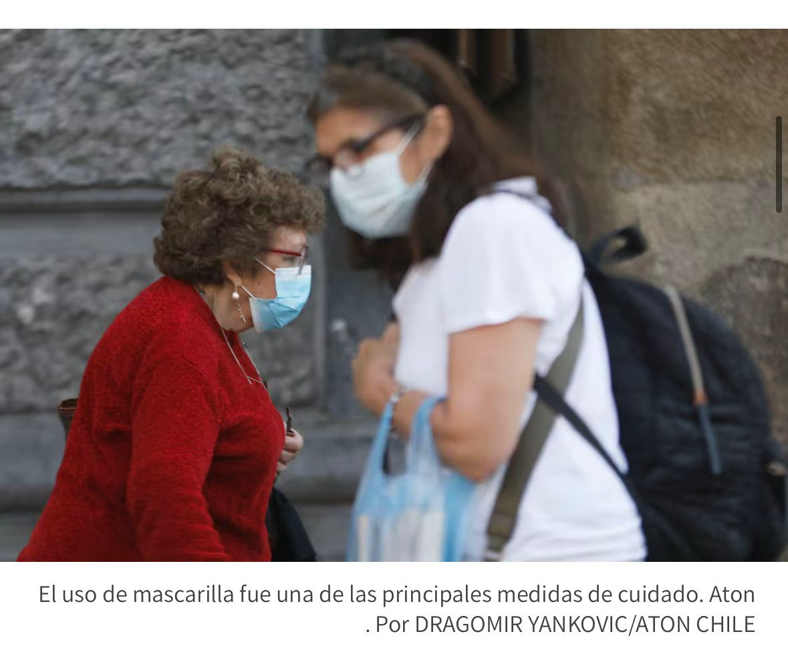
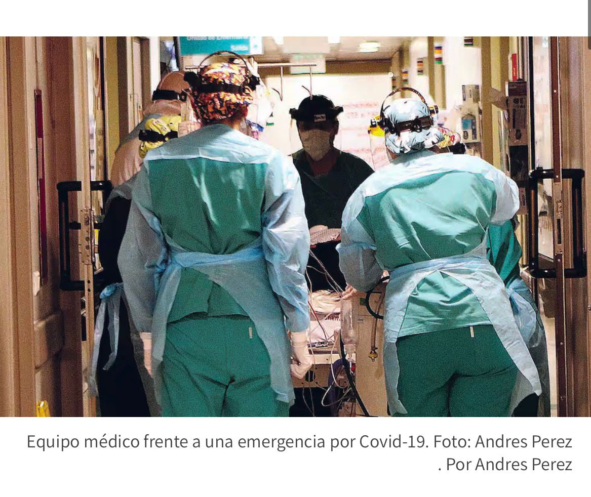

## Las lecciones que dejó el Covid-19 en Chile a 6 años del primer cese masivo de actividades presenciales

 https://www.latercera.com/nacional/noticia/las-lecciones-que-dejo-el-covid-19-en-chile-a-6-anos-del-primer-cese-masivo-de-actividades-presenciales/

**Descripción**

La webstory analiza las principales consecuencias que dejó la pandemia de Covid-19 seis años después del inicio de las primeras restricciones sanitarias. La noticia comienza recordando el 16 de marzo de 2020, día en que se suspendieron las clases presenciales y comenzaron a implementarse medidas como el teletrabajo, las cuarentenas y las reuniones online.

A partir de ese punto, el artículo explica cómo el país enfrentó la crisis sanitaria y cuáles fueron algunos de los aprendizajes que dejó la pandemia. Para esto, se incluyen distintos datos que ayudan a dimensionar la escala de lo vivido, como la cifra de que hubieron más de **5,2 millones de casos confirmados en Chile y cerca de 63.000 personas fallecidas**.

La historia también incorpora testimonios de especialistas en salud, quienes analizan las medidas tomadas durante la pandemia. Entre ellas se destacan el uso de mascarilla, la campaña de vacunación y la coordinación del sistema público y privado de salud. 

Además, el reportaje ayuda a recordar cómo cambió la vida cotidiana durante la pandemia. Muchas de las cosas que comenzaron en ese período, como el teletrabajo, las clases online o el uso más frecuente de mascarillas en algunos contextos, siguen presentes hoy y muestran cómo esa crisis dejó efectos duraderos en la sociedad. 

**Aspectos interesantes de la estructura narrativa**

Uno de los elementos más interesantes de esta webstory es su estructura, que combina contexto, datos estadísticos y testimonios de expertos. El relato parte con un momento clave de la pandemia y luego también mira el presente, mostrando como el Covid-19 transformó algunos aspectos de la vida cotidiana de las personas. 

El texto utiliza cifras destacadas para reforzar la información importante y facilitar la compresión del impacto que tuvo el virus. 
Además, incorpora citas de especialistas que interpretan estos datos y también reflexionan sobre los que nos dejó la pandemia.

Otro aspecto relevante es el uso de fotografías que acompaña la historia, mostrando escenas asociadas a la pandemia como el uso de mascarillas o el trabajo del personal de salud. Estas imágenes ayudan a contextualizar la información y a generar una conexión visual con los hechos descritos. 

## 
## 

**Evaluación de la efectividad para transmitir información**

En general, la webstory es efectiva para transmitir información porque presenta los hechos de manera clara y ordenada. El uso de datos, testimonios y ejemplos permite comprender tanto la magnitud de la pandemia como sus consecuencias en la sociedad. 

Sin embargo, desde una perspectiva de periodismo de datos, el reportaje podría incluir más objetos visuales como gráficos o infografías para representar las cifras de mejor manera. A pesar de esto, la combinación de texto y fotos logra construir un relato comprensible y reflexivo sobre uno de los momentos más críticos para el mundo en los últimos años. 

