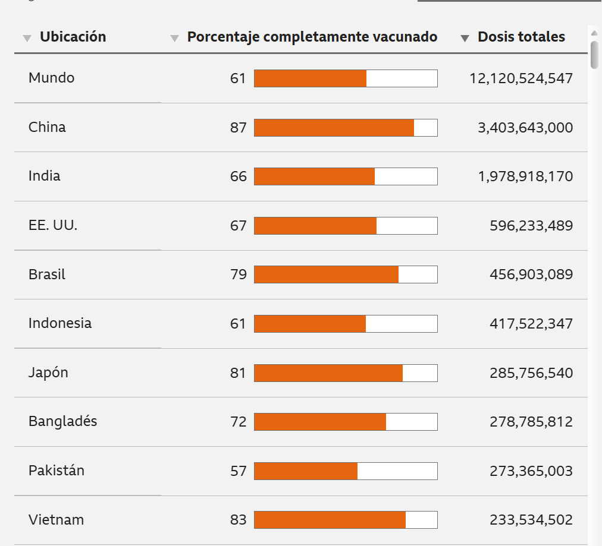
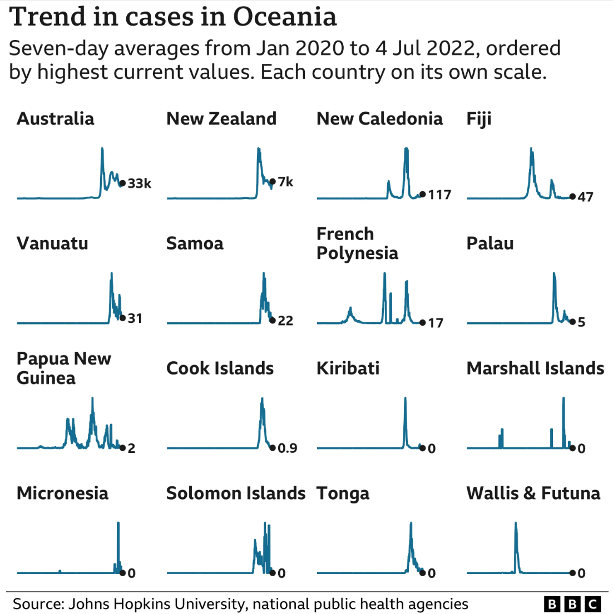

## Covid map: Coronavirus cases, deaths, vaccinations by country

 https://www.bbc.com/news/world-51235105

**Descripción**

La webstory analiza la evolución del Covid- 19 a nivel mundial a partir de datos cuantitativos.
A través de gráficos y tablas se muestran las cifras por país, mostrando la cantidad de contagiados, muertes y vacunados en distintas regiones del mundo.

Presenta una visión global de la pandemia desde su inicio en 2020, utilizando principalmente gráficos, como el de líneas con promedios de 7 días. Esto permite observar las variaciones en los contagios a lo largo del tiempo, evidenciando momentos en que los casos aumentan o disminuyen en cada país.

Por ejemplo, se presentan cifras específicas como el caso de Irán que **supera las 140.000 muertes y más de 7 millones de contagios**, o con Brasil, con **más de 600.000 muertes y más de 32.000.000 de casos confimados**. También se incluyen datos de Oceanía, donde Australia registra **un poco más de 10.000 muertos y más de 8.000.000 de casos confirmados**, lo que permite comparar el impacto del virus entre países. 

Además, la webstory incorpora información sobre la vacunación, mostrando el porcentaje de población vacunada y la cantidad de dosis administrada en distintos países. Lo que permite analizar cómo se reparte la vacuna a nivel global y cómo influyó estas en los países. 
## 

En conjunto, la historia permite comprender cómo el Covid-19 ha afectado de manera distinta en cada país, utilizando datos comparables y herramientas visuales que facilitan la lectura y el análisis de la información. 

**Aspectos interesantes de la estructura narrativa**

Uno de los aspectos más relevantes de la estructura narrativa es que la historia se construye directamente desde los datos. Cada sección empieza con una visualización (como gráficos de barras o de líneas), que presentan información concreta. El texto cumple con un rol explicativo para ayudar a interpretarla.

La webstory está organizada por regiones del mundo, como Medio Oriente y Oceanía, lo que permite comparar países dentro de un mismo contexto geográfico. 
## 

Otro elemento importante es el uso de promedios de 7 días en los gráficos. Este recurso permite observar de forma más clara las variaciones en los contagios a lo largo del tiempo. De esta manera, el lector puede identificar tendencias generales en vez de fijarse en cifras aisladas. 

Además, la estructura combina distintos tipos de datos, como cifras totales de contagio, número de muertes y porcentaje de vacunación. Esto permite construir una visión más completa de la pandemia, ya que no se presenta solo un indicador, sino varias dimensiones del fenómeno. 

**Evaluación de la efectividad para transmitir información**

La webstory es efectiva para transmitir información porque permite entender la pandemia a partir de datos, que aislados podrían llegar a ser complicados pero en conjunto y con herramientas visuales quedan claros. 

El uso de gráficos facilita identificar diferencias entre países y observar cómo varían los contagios y muertes en el tiempo. Por ejemplo, al comparar países dentro de una misma región, se pueden ver contrastes en la cantidad de casos o en la evolución de estos, lo que ayuda a entender que el impacto del Covid-19 no fue igual en todo el mundo. 

Además, con todas los tipos de datos que se exponen y las herramientas visuales que los acompañan, se logra analizar de manera clara, algo tan complejo como el virus.  

Otro aspecto relevante es que la noticia incluye información sobre las limitaciones de los datos, señalando que no todos los países registran los casos de la misma forma, aportando transparencia. 

